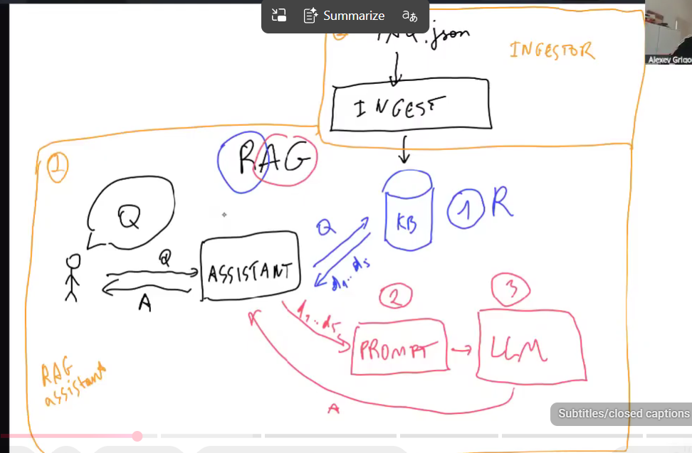

knowledge base is the common element here

#elasticsearch
Elasticsearch is the industry standard for text search.

It supports:

Full-text search with BM25
Filtering, aggregations, and faceting
Vector search (dense and sparse)
Distributed scaling
Real-time indexing