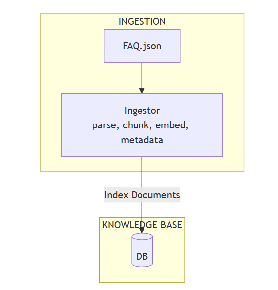

#sqlitesearch

SQLite FTS5
full text search built in 
database = sqlite 

Comparing the two approaches
With minsearch (single process):

Startup: fetch data -> parse -> index -> ready
Every restart: repeat all steps
With sqlitesearch (two processes):

Ingestion (runs once): fetch data -> parse -> write to faq.db
Query (runs every time): open faq.db -> search -> ready

For larger production systems, use the same pattern with a different backend:

Elasticsearch
OpenSearch
Qdrant (vector database)
Weaviate (vector database)